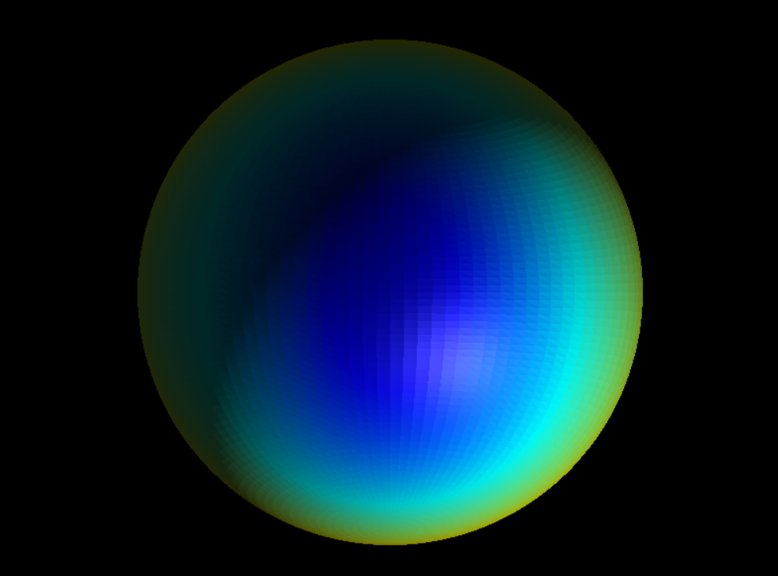

# Scientific Field Visualizer

A real-time scalar field visualizer built on Direct3D 11, rendering a per-vertex
scientific field (stress-like distribution) over a high-resolution triangle mesh
with colormaps, isolines, wireframe overlay, and interactive deformation.

---

## Mesh Choice — Why a Procedural UV-Sphere

A procedural UV-sphere (80 stacks × 80 slices = **12,800 triangles**) was chosen
because I have prior work experience with procedural mesh generation and am already
familiar with the patterns involved.  This meant I could focus implementation time
on the shader pipeline and feature set rather than on asset loading or mesh tooling.

Practical advantages of this choice:

- **Zero file-I/O dependency** — no asset path to manage; the mesh is always
  available and always identical across machines.
- **Analytically perfect normals** — on a unit sphere every vertex position *is*
  the outward normal (`normal == normalize(position)`), which gives a clean
  baseline before any GPU deformation is applied.
- **Controllable resolution** — stack/slice counts are single constants; the
  triangle budget can be adjusted with one line change.
- **Good test case for displacement** — the radially-symmetric scalar field
  `f(x,y,z) = sin(x)·cos(z)·0.5 + 0.5` and outward displacement produce
  visually distinctive deformation that clearly exercises the GPU pipeline.

---

## Normal Strategy — Face Normals Recomputed by Compute Shader

**At rest (no deformation):** the sphere normals (`position == normal`) are smooth
per-vertex normals stored directly in the vertex buffer.

**At runtime with any non-zero displacement amplitude:** the `NormalComputeShader`
runs a per-face normal recomputation pass every frame.
Each triangle's three deformed positions are used to compute `cross(edge0, edge1)`,
giving a face normal that matches the actual displaced geometry.  This face-normal
approach is justified here because:

- Each quad of the original sphere is split into exactly two triangles, so face
  normals per triangle capture curvature well at the ~12k triangle density.
- The deformation field is not smooth (it follows `scalarValue` which is `sin·cos`),
  so interpolating the original smooth normals across deformed triangles would be
  *worse* than per-face normals after deformation.

---

## Controls

### Camera
| Input | Action |
|---|---|
| Left-drag | Orbit around mesh center |
| Right-drag | Pan (slide the orbit target) |
| Scroll wheel | Zoom in / out |

### Visualization
| Key | Action |
|---|---|
| `C` | Toggle colormap: **Viridis** ↔ **Jet** |
| `W` | Toggle **wireframe** overlay |
| `I` | Toggle **isoline** contours |
| `[` | Decrease isoline interval (denser contours) |
| `]` | Increase isoline interval (sparser contours) |

### Scalar Range
| Key | Action |
|---|---|
| `1` | Move scalar **min** down |
| `2` | Move scalar **min** up |
| `3` | Move scalar **max** down |
| `4` | Move scalar **max** up |

Values outside [min, max] are shown in **dark grey**.

### Object Rotation
| Key | Action |
|---|---|
| `←` | Rotate mesh left (Y axis) |
| `→` | Rotate mesh right (Y axis) |
| `↑` | Tilt mesh up (X axis) |
| `↓` | Tilt mesh down (X axis) |

### Deformation
| Key | Action |
|---|---|
| `U` | Increase displacement amplitude |
| `J` | Decrease displacement amplitude |

At non-zero amplitude the mesh visually deforms outward and the GPU normal-recompute
pass keeps lighting correct.

---

## How to Build and Run

### Requirements
- **Visual Studio 2022** (any edition) with the **Desktop development with C++** workload
- **Windows SDK 10.0+** (Direct3D 11 headers and `d3dcompiler.lib` are part of the SDK)
- No external packages or NuGet dependencies

> **Which solution file to open:**
> | File | Works with |
> |---|---|
> | `ScientificFieldVisualizer.sln` | VS 2022 (all versions) — **recommended** |
> | `ScientificFieldVisualizer.slnx` | VS 2022 **v17.10+** only |
>
> Both files reference the same project. Use `.sln` if the Open Solution dialog does not show `.slnx`.

### Steps

1. Open `ScientificFieldVisualizer.sln` (or `.slnx` if on VS 2022 v17.10+) in Visual Studio 2022.
2. Set the configuration to **Debug** (or Release) and the platform to **x64**.
3. Press **F7** (or *Build → Build Solution*) — the project should compile with zero errors.
4. Press **F5** (or *Debug → Start Debugging*) to run.

### Shader files
All shaders are compiled at runtime via `D3DCompileFromFile`.  Visual Studio is
configured (via the project's Debugging → Working Directory = `$(ProjectDir)`) so
the `.hlsl` files are found automatically when launching from the IDE.  If you run
the `.exe` directly from `x64\Debug\`, copy the `.hlsl` files next to it first.

---

## Features Implemented

### Core
| Feature | Detail |
|---|---|
| Triangle mesh ≥ 5,000 triangles | Procedural UV-sphere, **12,800 triangles** |
| Per-vertex scalar field | `f = sin(x)·cos(z)·0.5 + 0.5` |
| Analytical colormaps | Viridis (degree-6 polynomial) and Jet (piecewise linear) |
| Orbital camera | Left-drag orbit, right-drag pan, scroll zoom |
| Lambertian diffuse lighting | Hardcoded light dir `(1,1,−1)`, 0.15 ambient |
| Blinn-Phong specular | Halfway-vector H, shininess = 32, white highlight separate from colormap |

### Level 2
| Feature | Detail |
|---|---|
| Colormap selector | Runtime toggle with **C** key |
| Wireframe overlay | Barycentric `fwidth` trick — no second draw call |
| Scalar range control | Interactive clamp via **1/2/3/4** keys; out-of-range shown in dark grey |

### Level 3
| Feature | Detail |
|---|---|
| Displacement / deformation | Per-vertex outward push by `scalarValue × amplitude` in the vertex shader |
| Isoline rendering | Anti-aliased band isolines; interval user-controlled via **[ ]** keys |
| GPU compute — scalar smoothing | `ComputeShader.hlsl`: per-face average of 3 corner scalars, result fed to VS via `t0` |
| GPU compute — normal recompute | `NormalComputeShader.hlsl`: rebuilds face normals from displaced geometry every frame, fed to VS via `t1` |

---

## One Thing I Would Do Differently With More Time

With more time I would improve how surface normals are calculated after the mesh
is deformed.  Right now every triangle gets one flat normal shared across its three
corners, which causes visible hard edges at high deformation.  A better approach
would be to blend the normals at shared corners so the surface looks smooth.
I skipped this because it requires some extra GPU synchronisation that was outside
the scope of the project, but it would noticeably improve the visual quality.
